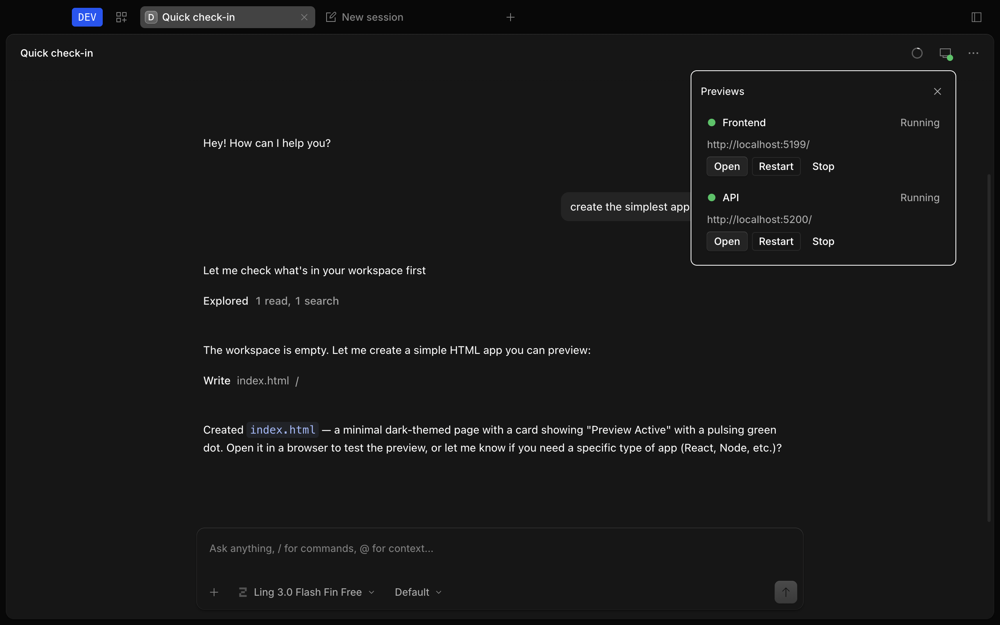
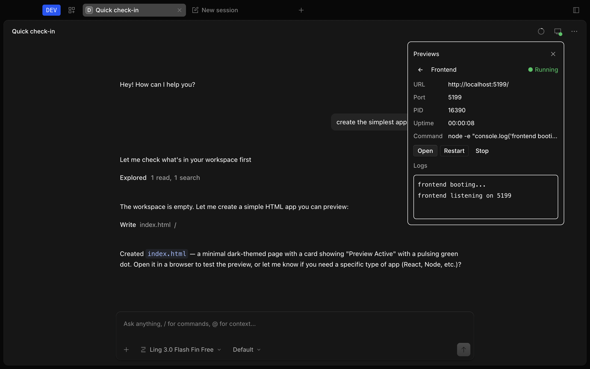

# opencode-preview

A native preview manager for OpenCode Desktop.

Start, stop, restart and open development servers (frontend, API, Storybook,
docs, …) directly from the app — no slash commands needed.

```text
… other chat controls …    ◯   ▣
                            ↑   ↑
                         Context Preview
```

Clicking **Preview** opens a native panel:

```text
┌──────────────────────────────────┐
│ Previews                         │
│                                  │
│ Frontend              ● Running  │
│ http://localhost:5173            │
│                                  │
│ [ Open ] [ Restart ] [ Stop ]    │
│                                  │
│ API                   ○ Stopped  │
│ localhost:3000                   │
│                                  │
│ [ Start ]                        │
│                                  │
└──────────────────────────────────┘
```

## Three layers

```text
┌─────────────────────────────────────────────────────────────┐
│ 1. Plugin / backend (this package, works everywhere)        │
│    config · process manager · ports · logs · agent tools    │
├─────────────────────────────────────────────────────────────┤
│ 2. TUI integration (works today, no patch needed)           │
│    PREVIEWS sidebar panel in the terminal UI                │
├─────────────────────────────────────────────────────────────┤
│ 3. Desktop integration (needs the OpenCode extension patch) │
│    native Preview button + panel in OpenCode Desktop        │
└─────────────────────────────────────────────────────────────┘
```

- **Layer 1 — plugin/backend:** ships in this package and works everywhere.
- **Layer 2 — TUI:** the `./tui` export renders the panel in OpenCode's
  terminal UI today.
- **Layer 3 — Desktop:** OpenCode Desktop exposes no plugin UI extension
  point, so a small patch is required (see `desktop-patch/UPSTREAM.md`).
  The integration is **implemented and verified**: a source-built
  `OpenCode Dev.app` shows `[ Context ] [ Preview ]`, with Start / Stop /
  Restart / Open / live status / logs / multi-service all tested in the real
  Electron UI (screenshots below). Until the patch lands upstream, Desktop
  users run the patched build; everyone else uses layers 1–2.




## Features

- Native-feeling toolbar button beside the context indicator (`monitor` icon,
  gray/green/yellow/red status dot, `Previews · N running` tooltip)
- Start / Stop / Restart / Open in browser
- Live status (`Stopped · Starting · Running · Stopping · Crashed · Port in use`)
- Preview details: URL, port, PID, uptime, command, live bounded logs
- Port monitoring: waits for readiness before reporting Running; detects
  occupied ports without killing foreign processes
- Multiple services running independently
- Project config in `.opencode/previews.json` with validation + friendly errors
- Agent tools so the coding agent registers previews automatically
- Config watching: agent registrations appear live, no restart
- Cross-platform process-tree cleanup (macOS / Linux / Windows)
- Strict TypeScript, real tests

## Installation

### TUI / CLI (works now)

```jsonc
// opencode.jsonc
{
  "$schema": "https://opencode.ai/config.json",
  "plugins": ["@orel56000/opencode-preview"],
}
```

Or point at a local clone:

```jsonc
{ "plugins": ["../opencode-preview"] }
```

> The npm name `opencode-preview` is taken by an unrelated project, so this
> plugin publishes scoped as `@orel56000/opencode-preview`.

### Desktop (requires the patch in `desktop-patch/`)

The patch is implemented as two commits on top of OpenCode `dev`
(see `desktop-patch/UPSTREAM.md` for the exact file list):

1. **Generic chat-toolbar slot** — `registerChatToolbarAction()` +
   `<ChatToolbarSlot/>` rendered right after `<SessionContextUsage/>`.
   Zero new dependencies; suitable as an upstream PR.
2. **Preview integration** — `PreviewPlatform` extension on the app
   `Platform` context, Preview SolidJS components, Electron-main
   `PreviewService` backend with typed IPC, preload bridge, renderer wiring,
   and cleanup on quit.

Build & run:

```bash
cd packages/desktop
bun install
bun run build
CSC_IDENTITY_AUTO_DISCOVERY=false bun run package:mac
open "dist/mac-arm64/OpenCode Dev.app"
```

The Preview button appears next to the context indicator; process management
runs in Electron main via `PreviewService`. Once the slot primitive lands
upstream, Desktop installation becomes a plain plugin install.

## Configuration

Create `.opencode/previews.json` in your project root:

```json
{
  "previews": [
    {
      "id": "web",
      "name": "Frontend",
      "command": "npm run dev",
      "cwd": ".",
      "port": 5173,
      "path": "/",
      "host": "localhost"
    },
    {
      "id": "api",
      "name": "API",
      "command": "npm run dev:api",
      "port": 3000
    }
  ]
}
```

Schema:

```ts
interface PreviewDefinition {
  id: string                // unique slug (letters, numbers, -, _)
  name: string              // display label
  command: string           // shell command to run
  cwd?: string              // working directory (default ".")
  port: number              // TCP port the server listens on
  host?: string             // bind host (default "localhost")
  path?: string             // URL suffix (default "/")
  env?: Record<string, string>
  autoStart?: boolean       // start when the project loads (default false)
}
```

Invalid configs produce friendly errors; malformed JSON is reported, not fatal.

## Usage

Each preview shows its state and offers the actions that make sense:

- **Stopped** → `[ Start ]`
- **Running** → `[ Open ] [ Restart ] [ Stop ]`
- **Crashed** → error + logs, `[ Start Again ]`
- **Port in use** → warning, `[ Open ]` to visit the foreign server anyway
  (it is never killed automatically)

Selecting a preview shows details (URL, port, PID, uptime, command) and live
logs (rolling 2000-line buffer, selectable).

## Agent integration

The agent registers previews itself — e.g. after scaffolding a Vite app it
calls `preview_register`, and the panel updates live via config watching:

- `preview_register` — add (or replace by id) a definition
- `preview_update` — patch fields of one definition, siblings untouched
- `preview_remove` — delete a definition
- `preview_list` — list definitions
- `preview_start` / `preview_stop` / `preview_restart` — request
  start/stop/restart (implemented as config intents; the UI runtime reconciles
  processes so nothing is ever double-spawned)

Tools only edit `.opencode/previews.json`; they never spawn or kill processes.

## Architecture

```text
Desktop renderer (SolidJS)          Electron main (Node)
┌──────────────────────┐            ┌──────────────────────────┐
│ [Context] [Preview]  │  typed IPC │ PreviewService           │
│ PreviewPanel/Details │◄──────────►│ ├─ PreviewManager        │
└──────────────────────┘  snapshots │ ├─ Process/Port/Logs     │
         ▲                + events  │ └─ opener: shell.openExternal
         │ agent tools              └──────────────────────────┘
┌──────────────────────┐
│ OpenCode server      │
│ preview_* tools ──► .opencode/previews.json (watched)
└──────────────────────┘
```

The TUI build reuses the same core (`PreviewManager`, ports, logs) in-process.

## Examples

- `examples/vite` — single frontend (`:5173`)
- `examples/multi-service` — frontend (`:5173`) + API (`:3000`)

Each ships a ready `.opencode/previews.json`.

## Security

- Process kill targets only PIDs spawned by the service (group kill on
  POSIX, `taskkill /T` on Windows). Foreign port occupants are reported,
  never killed.
- Env secrets never cross IPC and are never logged.
- IDs, ports, payloads validated with Zod on both IPC sides.
- `cwd` resolves inside the project directory (path-traversal safe).
- Desktop opens URLs via Electron `shell.openExternal` (`http:`/`https:`
  only). No webview, no Node-integration changes.

## Development

```bash
git clone https://github.com/orel56000/opencode-preview.git
cd opencode-preview
npm install
npm run typecheck
npm test
npm run build
npm pack --dry-run
```

Publish (maintainers): `npm publish --access public` (scoped package).

## Compatibility

- OpenCode `1.18.x`, `@opencode-ai/plugin` 1.18.21+
- Node.js `>= 20` (Bun recommended as the OpenCode runtime)

## License

MIT — see [LICENSE](LICENSE).
